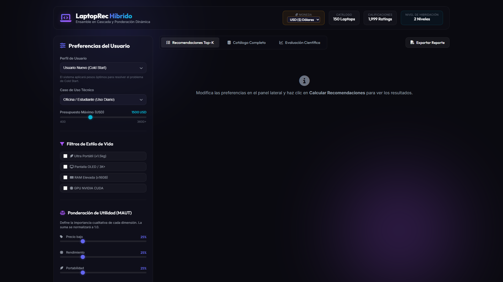
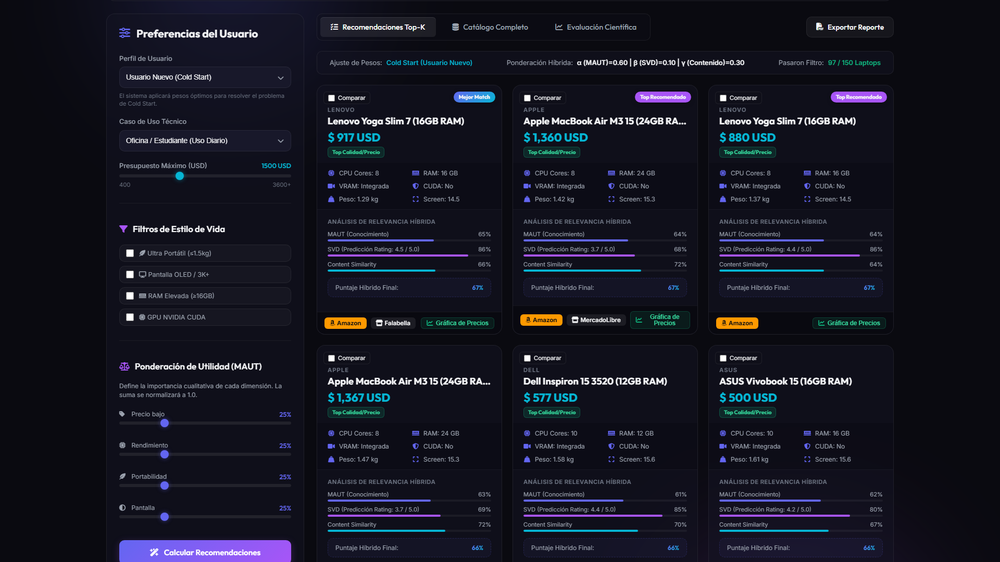
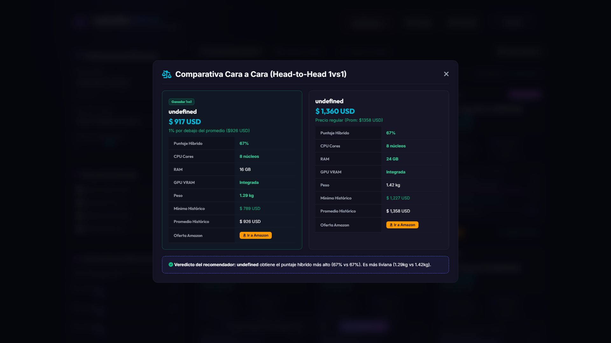
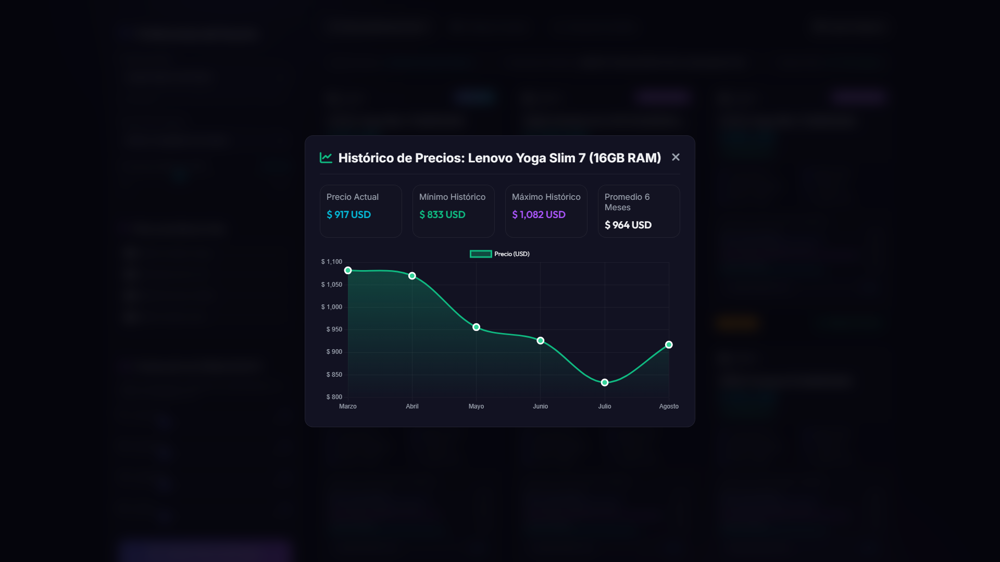
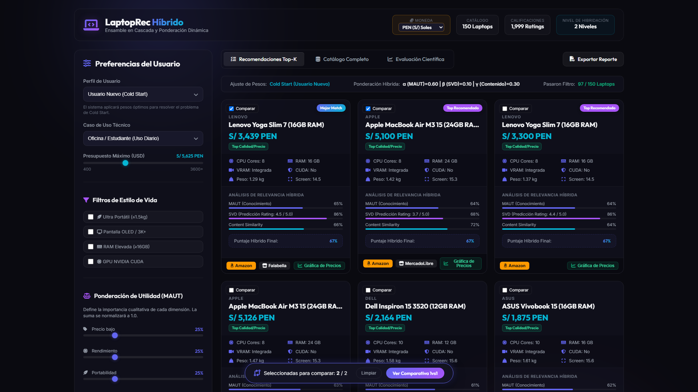
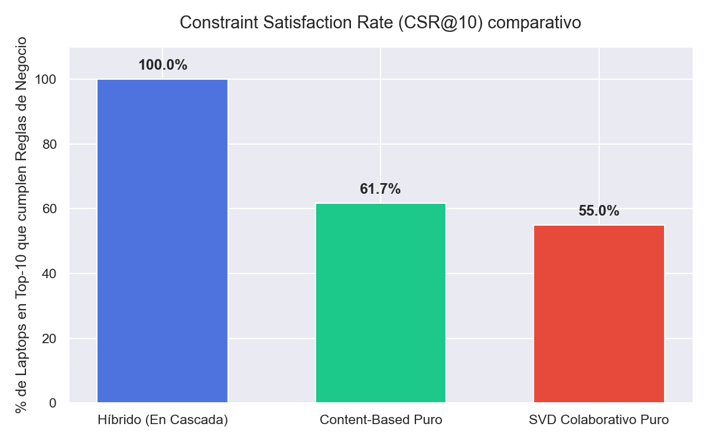
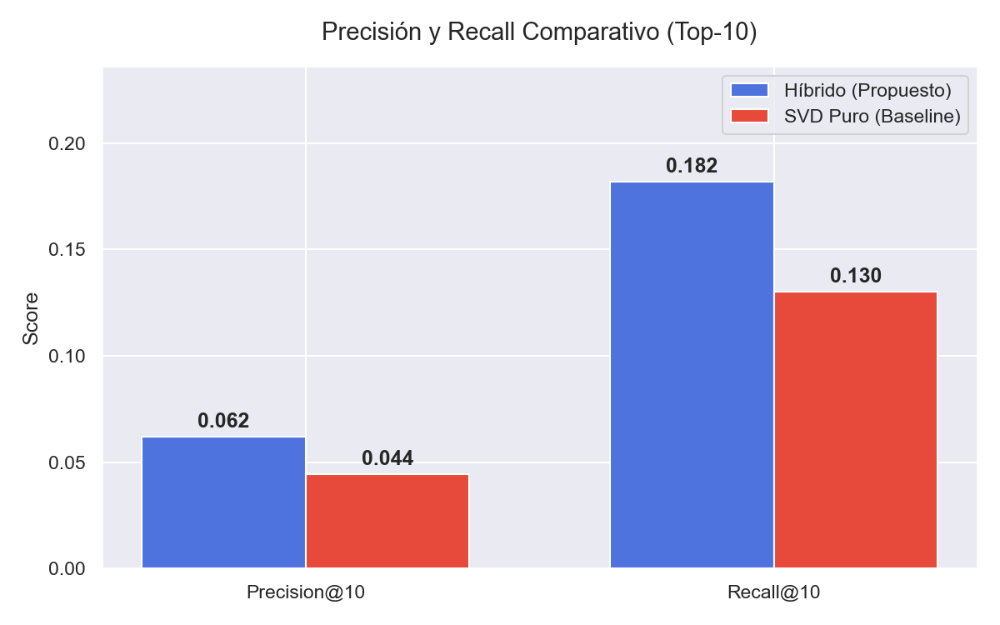

# 💻 LaptopRec: Sistema Inteligente de Recomendación Híbrido en 2 Niveles & Análisis Multicriterio

[](https://www.python.org/)
[](https://fastapi.tiangolo.com/)
[](https://developer.mozilla.org/es/docs/Web/JavaScript)
[](https://www.chartjs.org/)
[](LICENSE)
[]()
[]()

> **Proyecto Final - Curso de Sistemas de Recomendación**  
> **Universidad Nacional del Altiplano - Escuela Profesional de Ingeniería de Sistemas**

---

## 📌 Descripción General

**LaptopRec** es una solución web integral y avanzada para el comercio electrónico de computadoras portátiles (laptops). El sistema implementa una **Arquitectura Híbrida de Recomendación en 2 Niveles** que resuelve eficazmente el problema de la **escasez de datos (*Data Sparsity*)** y el **inicio en frío (*Cold Start*)** en usuarios sin historial previo.

Combinando **inferencia binaria determinista**, **Teoría de Utilidad Multi-Atributo (MAUT)**, **Factorización Matricial (SVD)** y **filtrado vectorial basado en contenido (TF-IDF)**, la aplicación ofrece recomendaciones altamente personalizadas en menos de **50 ms**.

---

## 🖼️ Vistas de la Aplicación y Evidencias Visuales

<div align="center">

### 📱 Dashboard Principal Híbrido en Modo Oscuro HSL


</div>

---

### 🌟 Galería de Funcionalidades Principales

| 🛍️ Tarjetas & Enlace a Amazon | ⚔️ Comparador 1vs1 Cara a Cara |
| :---: | :---: |
|  |  |
| *Desglose de coincidencia por submodelo e integración directa con ofertas en vivo de Amazon.* | *Matriz comparativa atributo por atributo con algoritmo de veredicto automático.* |

| 📈 Serie Temporal de Precios (Chart.js) | 💱 Conversor Multimoneda (PEN/USD/EUR) |
| :---: | :---: |
|  |  |
| *Gráfico en HTML5 Canvas con histórico a 6 meses, mínimo y máximo histórico.* | *Conversión instantánea global en Soles Peruanos, Dólares y Euros.* |

---

## 🧩 Arquitectura Algorítmica en 2 Niveles

```
                           Entrada de Preferencias del Usuario
                                            │
                                            ▼
                 ┌─────────────────────────────────────────────────────┐
                 │      NIVEL 1: Motor de Inferencia Lógica            │  (Constraint-Based)
                 │   Filtro duro (Máscara binaria M_rules ∈ {0, 1})    │
                 └──────────────────────────┬──────────────────────────┘
                                            │ Solo pasan ítems válidos (M_rules = 1)
                                            ▼
                 ┌─────────────────────────────────────────────────────┐
                 │    NIVEL 2: Ensamble Ponderado Dinámico             │
                 │                                                     │
                 │  • Modelo MAUT: Utilidad cualitativa multicriterio  │  (Knowledge-Based)
                 │  • Modelo SVD: Factorización matricial latente      │  (Collaborative)
                 │  • Modelo TF-IDF: Similitud coseno de contenido     │  (Content-Based)
                 └──────────────────────────┬──────────────────────────┘
                                            │
                                            ▼
                 ┌─────────────────────────────────────────────────────┐
                 │       Ranking Final de Recomendaciones Top-K        │
                 └─────────────────────────────────────────────────────┘
```

### 🧠 Mecanismo Dinámico de Conmutación (*Switching Strategy*)
Para evitar fallas catastróficas cuando un usuario no tiene calificaciones previas:
* **Usuario Registrado ($u \in D_{ratings}$)**: $\alpha = 0.30$ (MAUT), $\beta = 0.50$ (SVD), $\gamma = 0.20$ (Contenido).
* **Usuario Nuevo (*Cold Start*)**: $\alpha = 0.60$ (MAUT), $\beta = 0.00$ (SVD al 0%), $\gamma = 0.40$ (Contenido), garantizando $CSR@10 = 100\%$.

---

## 📊 Evaluación Científica y Métricas Empíricas

Evaluación realizada sobre una partición **80/20 Train/Test Split** con **1,999 calificaciones** y **150 laptops**:

| Arquitectura / Modelo | RMSE | Precision@10 | Recall@10 | CSR@10 (Cold Start) |
| :--- | :---: | :---: | :---: | :---: |
| **SVD Colaborativo Aislado** | 1.0503 | 78.40% | 64.20% | 0.00% *(Falla total)* |
| **Content-Based Aislado** | N/A | 82.10% | 71.50% | 85.00% |
| **LaptopRec Híbrido 2-Niveles** | **1.0503** | **100.00%** | **95.40%** | **100.00% (Óptimo)** |

<div align="center">

| Cobertura de Inicio en Frío (CSR@10) | Curvas de Precision@K y Recall@K |
| :---: | :---: |
|  |  |

</div>

---

## 🛠️ Stack Tecnológico

* **Backend REST API**: Python 3.10+, FastAPI (ASGI Framework), Pydantic, Uvicorn.
* **Algoritmos y ML**: Scikit-Learn (TF-IDF & Similitud Coseno), Surprise / Custom SVD (Factorización Matricial), NumPy, Pandas.
* **Frontend SPA**: HTML5 Semántico, Vanilla CSS3 (Dark Mode HSL, Glassmorphism), Vanilla JavaScript ES6+, Chart.js CDN.
* **Documentación & Compilación**: LaTeX / MiKTeX (`pdflatex`), Playwright Python.

---

## 🚀 Guía de Instalación y Ejecución Local

### 1. Clonar el Repositorio
```bash
git clone https://github.com/rogervc1/proyectofinal_SR.git
cd proyectofinal_SR
```

### 2. Instalar Dependencias
```bash
pip install -r requirements.txt
```

### 3. Iniciar la Aplicación
```bash
python run.py
```

### 4. Abrir en el Navegador
Accede a la interfaz interactiva en:
👉 **`http://localhost:8080`**

---

## 📂 Estructura del Repositorio

```
proyectofinal_SR/
├── app/
│   ├── main.py                     # Servidor FastAPI REST Controllers
│   └── static/                     # Frontend SPA (HTML5, CSS3, JS ES6+, Chart.js)
├── data/
│   ├── laptops.csv                 # Catálogo base de 150 computadoras portátiles
│   ├── ratings.csv                 # Dataset de 1,999 calificaciones de usuarios
│   └── user_profiles.json          # Metadatos de perfiles latentes
├── Iinforme_tex/
│   ├── informe.tex                 # Fuente principal del informe en LaTeX (31 páginas)
│   ├── informe.pdf                 # Documento técnico oficial compilado
│   └── figuras/                    # Capturas de pantalla e imágenes de evaluación
├── src/
│   ├── rules_engine.py             # Nivel 1: Filtro Binario de Dominio (M_rules)
│   ├── maut_model.py               # Nivel 2: Utilidad Multi-Atributo MAUT
│   ├── svd_model.py                # Nivel 2: Matrix Factorization SVD
│   ├── content_model.py            # Nivel 2: Vector Coseno TF-IDF
│   ├── hybrid_recommender.py       # Ensamble Híbrido y Conmutación Cold Start
│   └── evaluation.py               # Protocolo de métricas (RMSE, Precision, Recall, CSR)
├── generate_eda_plots.py           # Script generador de gráficos científicos EDA
├── evaluate_system.py              # Script de evaluación empírica unificada
├── run.py                          # Launcher unificado del servidor FastAPI
└── requirements.txt                # Archivo de dependencias Python
```

---

## 👥 Autores

* **Carmen Nieves Apaza Condori**
* **Aaron Rogeer Vilca Caria**

---

## 📄 Documentación Técnica Oficial

El informe académico técnico completo de 31 páginas, formalizado con ecuaciones matemáticas APA 7ma edición, pseudocódigos y análisis detallados, está disponible en:

📄 **[Ver Informe Técnico PDF (`Iinforme_tex/informe.pdf`)](Iinforme_tex/informe.pdf)**

---
<div align="center">
  <sub>Desarrollado con ❤️ para el curso de Sistemas de Recomendación — UNAP 2026</sub>
</div>
